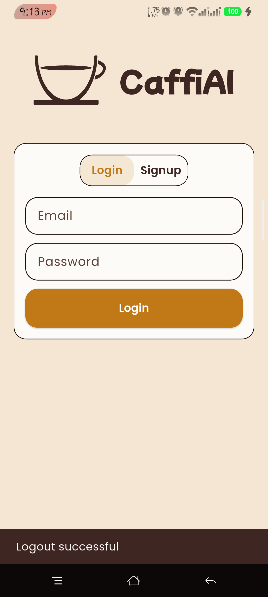
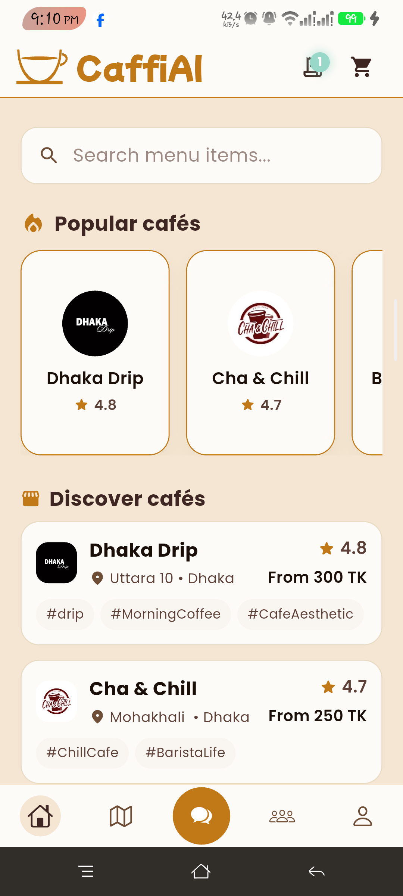
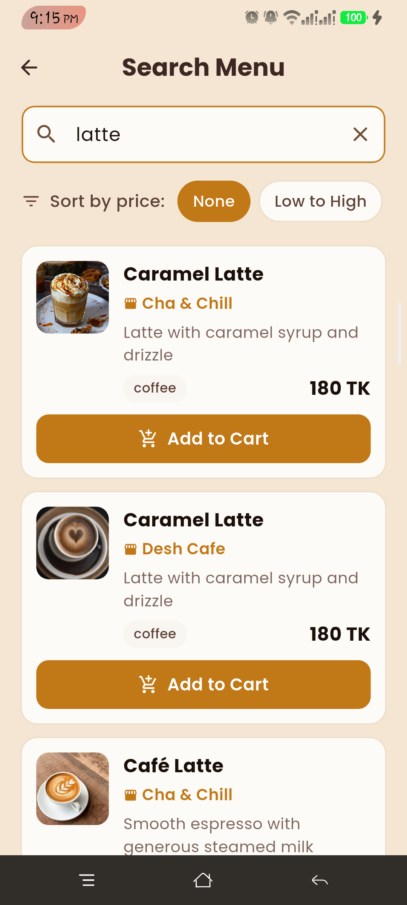
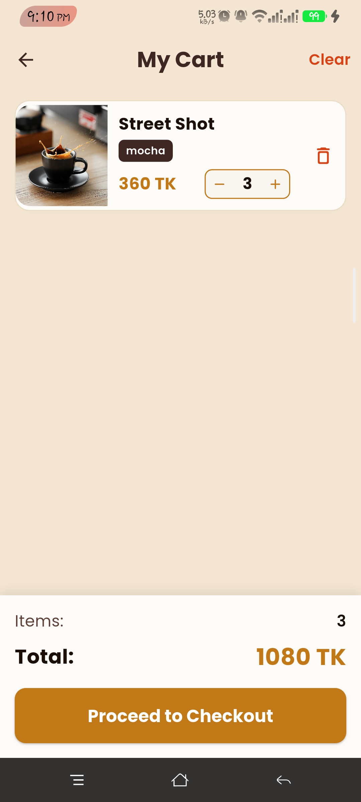
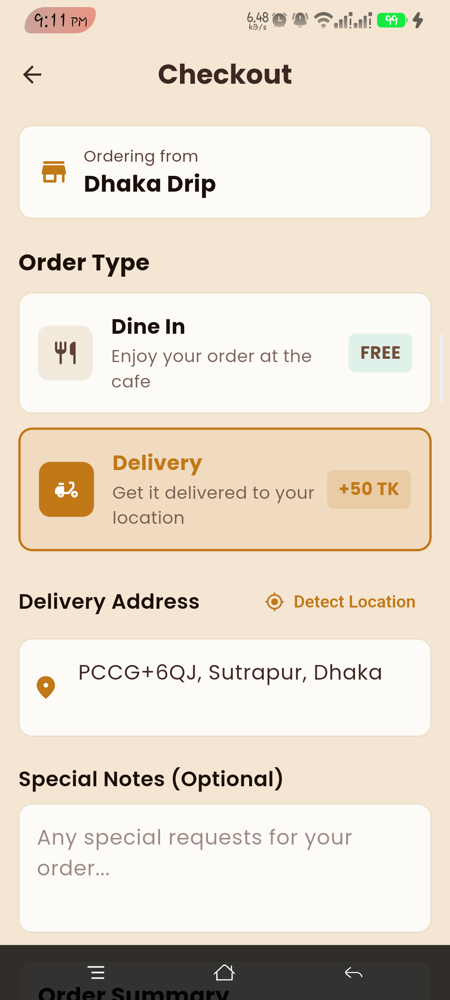
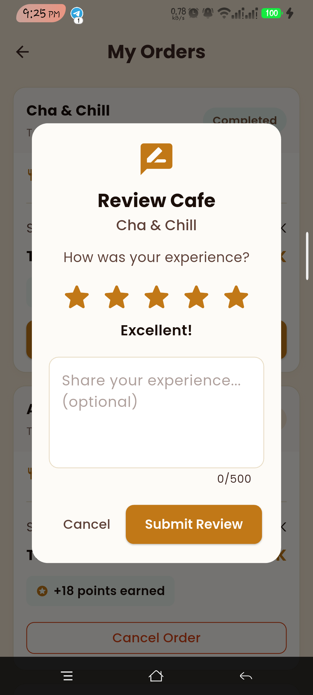
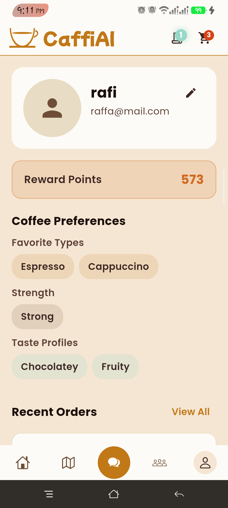

# ☕ CaffiAI

> An AI-powered coffee shop discovery and ordering app built with Flutter

CaffiAI brings the café experience to your fingertips — discover nearby cafes, order your favorite drinks, chat with an AI barista, and connect with fellow coffee lovers and order cafe with ai assitance.

---

## 🛠️ Built With


---

##  Features

| Feature | Description |
|---------|-------------|
| 🔐 **Authentication** | Secure login/signup with Firebase |
| 🗺️ **Cafe Discovery** | Browse cafes via list view or interactive map |
| 📍 **Location-Based** | See real-time distance to each cafe |
| 🍽️ **Menu Categories** | Coffee, Food, Drinks, Desserts |
| 🛒 **Ordering System** | Seamless cart & checkout experience |
| 🤖 **AI Chatbot** | Get personalized coffee recommendations based on preferences & weather |
| 🎯 **AI-Assisted Orders** | Order directly through the chatbot |
| 💬 **Community Chat** | Live chat with coffee enthusiasts |
| ⭐ **Reviews** | Rate and review your favorite cafes |
| 🎁 **Rewards** | Earn points on every order |
| ⚙️ **Preferences** | Set your coffee taste preferences |
| 👨‍💼 **Admin Panel** | Web dashboard for cafe owners to manage their cafe |

---

##  Tech Stack

| Layer | Technology |
|-------|------------|
| Framework | Flutter (Dart) |
| Backend | Firebase (Firestore) |
| Auth | Firebase Authentication |
| State Management | Provider |
| AI | Google Generative AI (Gemini 2.5 Flash) |
| Weather | OpenWeatherMap API |
| Image Hosting | ImageKit |
| Admin Panel | Next.js |

---

##  Project Structure

```
lib/
├── main.dart          # App entry point & navigation
├── models/            # Data models
├── pages/             # UI screens
├── services/          # Business logic & APIs
├── theme/             # Brand styling
└── widgets/           # Reusable components
```

---

##  Screenshots

<table>
  <tr>
    <td align="center"><b>Login</b></td>
    <td align="center"><b>Home</b></td>
    <td align="center"><b>Interactive Map</b></td>
  </tr>
  <tr>
    <td></td>
    <td></td>
    <td></td>
  </tr>
  <tr>
    <td align="center"><b>Menu</b></td>
    <td align="center"><b>Cart</b></td>
    <td align="center"><b>Checkout</b></td>
  </tr>
  <tr>
    <td></td>
    <td></td>
    <td></td>
  </tr>
  <tr>
    <td align="center"><b>AI Chat</b></td>
    <td align="center"><b>AI Recommendation</b></td>
    <td align="center"><b>AI Order</b></td>
  </tr>
  <tr>
    <td></td>
    <td></td>
    <td></td>
  </tr>
  <tr>
    <td align="center"><b>Order Confirmation</b></td>
    <td align="center"><b>Current Order</b></td>
    <td align="center"><b>My Orders</b></td>
  </tr>
  <tr>
    <td></td>
    <td></td>
    <td></td>
  </tr>
  <tr>
    <td align="center"><b>Community Chat</b></td>
    <td align="center"><b>Reviews</b></td>
    <td align="center"><b>Profile</b></td>
  </tr>
  <tr>
    <td></td>
    <td></td>
    <td></td>
  </tr>
  <tr>
    <td align="center"><b>User Preferences</b></td>
    <td align="center"><b>Recent Orders</b></td>
    <td></td>
  </tr>
  <tr>
    <td></td>
    <td></td>
    <td></td>
  </tr>
</table>

---

##  Links

| Resource | Link |
|----------|------|
| 📐 Wireframe | [Figma](https://www.figma.com/design/a1mkXjLuWqdQjEqf17lf5J/wireframe?node-id=0-1&t=JdOQuYQvOTQppiRT-1) |
| 📊 Database Schema | [Mermaid Chart](https://www.mermaidchart.com/d/90e3b03f-c103-4de7-9cec-c3df0210882c) |
| 💻 GitHub (App) | [CaffiAI](https://github.com/ahmrafi22/CaffiAI) |
| 🌐 GitHub (Admin) | [CaffiAI-Admin](https://github.com/ahmrafi22/CaffiAI-Admin) |

---

## 🚀 Getting Started

```bash
# Clone the repository
git clone https://github.com/ahmrafi22/CaffiAI.git

# Navigate to project
cd CaffiAI

# Install dependencies
flutter pub get

# Run the app
flutter run
```

---


